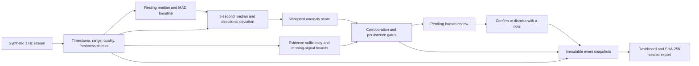

# VitalGuard architecture — implementation v1.1

VitalGuard is a single-process, synthetic-data decision-support prototype. Its contribution is an inspectable monitoring policy with explicit human authority and separately represented evidence availability. It is not a clinically validated or certified safety system.

## State contract

Two orthogonal dimensions prevent a pending decision from hiding a sensor outage:

| Dimension | Values | Invariant |
|---|---|---|
| Observation | CALIBRATING, MONITORING, WATCH, SENSOR CHECK, NO DATA | Stale input always means NO DATA, regardless of review |
| Review | NONE, REVIEW REQUESTED, HIGH PRIORITY, DISMISSED | Only an explicit valid confirmation can create HIGH PRIORITY |

Display state prioritizes NO DATA / SENSOR CHECK, and otherwise an active review. Both dimensions remain visible and are included in exported snapshots. Timeout adds one overdue event; it does not resolve the review. Dismissal suppresses repeat requests for the same episode but does not claim recovery.

Resolved episodes re-arm only after ten seconds of consecutive reliable recovery samples **after** the decision. Clock ticks cannot advance signal persistence or recovery. Missing intervals restart timers. A pending episode never auto-clears on physiological recovery. Review actions require a matching pending episode, a valid note and monotonic time; duplicate actions fail without changing state.

## Design decisions

1. **Freeze baseline after calibration.** Twenty consecutive accepted resting samples train per-session median and MAD. Unsupervised adaptation could absorb a slow anomaly into “normal.” No longitudinal adaptation or independent drift detector is implemented. A future recalibration command must be explicit, versioned and barred during unresolved review, with a retained baseline history.
2. **Separate evidence sufficiency from anomaly magnitude.** Missing input reduces confidence and widens a bounded missing-contribution interval; it never establishes health safety. See [UNCERTAINTY.md](UNCERTAINTY.md) for the exact equations and sensitivity protocol.
3. **Allow corroboration to override activity context.** Reliable oxygen severity ≥ 0.25 vetoes the HR/RR exercise discount. A misleading activity input alone should not explain away corroborated anomalies. Simultaneously misleading activity and oxygen can still defeat this model.
4. **Separate state from events.** Events are cloned and recursively frozen before append to a private list. Public event lists are frozen copies; snapshots and baseline objects are frozen. Current episode transitions create new objects and append new events. This prevents mutation through returned objects; it does not protect against arbitrary same-origin code or a malicious operator.
5. **Seal export contents.** Canonical JSON + SHA-256 detects content changes relative to the stored digest. An independently retained digest also detects complete replacement. A digest shipped alongside its own payload is not a signature or proof of origin: an attacker can recompute both. No tamper-proof storage, hash-chain anchoring, or identity verification is claimed.

## Persistence and concurrency boundary

Current runtime state is intentionally session-local; refresh loses it unless exported. The export is a durable snapshot file, not a resumable checkpoint or event-sourced replay store. All state-changing calls execute synchronously on one JS event loop; asynchronous export operates on a detached snapshot. This supplies local ordering, not multi-client consensus.

Production design (not implemented): an authenticated service owns each session; PostgreSQL stores event sequence, episode revision and review decision in one transaction. An update conditioned on `status = pending AND revision = expected` plus an idempotency key makes concurrent decisions conflict explicitly. An outbox in that transaction drives notifications with retry/deduplication. Raw input retention and externally signed/anchored audit checkpoints enable independent replay and integrity checks. Restore/replay must be versioned by detector and policy; healthcare deployment would also require appropriate data governance and real-world validation.

## Validation and remaining limits

`npm test` checks state transitions, failed actions, immutable history, timers, malformed input, context failures and sealed-export integrity. `npm run evaluate` runs deterministic synthetic cohorts, including known failures. These tests provide regression evidence for specified contracts, not a formal proof or a reliability certification. Real physiology, sensor-quality calibration, multiple co-failing sensors and deployment resilience remain unvalidated.
